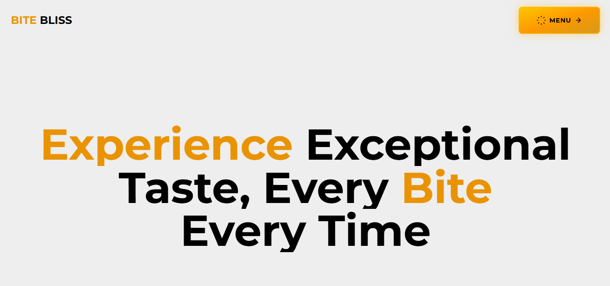

# BiteBliss 🍔

**BiteBliss** is a fully responsive and visually captivating restaurant website built using **React**, **Tailwind CSS**, **GSAP**, **Framer Motion**, and **SwiperJS**. The site takes creative inspiration from various modern restaurant websites — blending the best design elements into a smooth, animated frontend experience.

🔗 **Live Preview:** [bite-bliss-alpha.vercel.app](https://bite-bliss-alpha.vercel.app/)



---

## 🧰 Tech Stack

- ⚛️ React (via Vite)
- 🎨 Tailwind CSS
- 🎞️ GSAP (GreenSock Animation Platform)
- 🌀 Framer Motion
- 🖼️ SwiperJS (for sliders and carousels)
- ⚡ Vite (for blazing-fast dev environment)

---

## 🚀 Getting Started

To run this project locally:

```bash
git clone https://github.com/Sannan144/bitebliss.git
cd bitebliss
npm install
npm run dev
